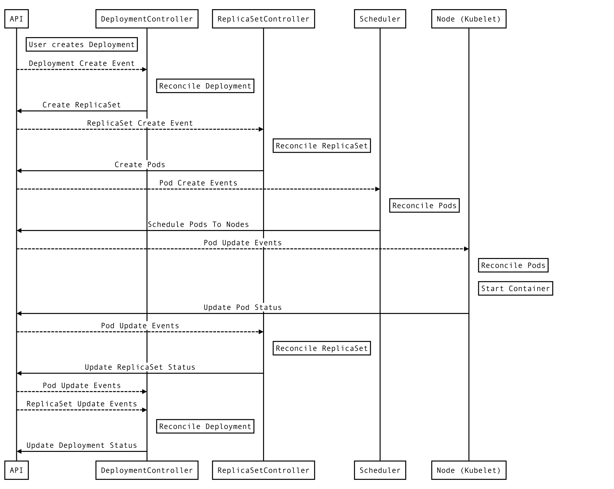

- Kubernetes Objects are persistent entities in the Kubernetes system. Kubernetes uses these entities to represent the state of your cluster.

- Every Kubernetes object includes two nested object fields that govern the object’s configuration: the object spec and the object status.

- The spec, which you must provide, describes your desired state for the object–the characteristics that you want the object to have.

- The status describes the actual state of the object, and is supplied and updated by the Kubernetes system. At any given time, the Kubernetes Control Plane actively manages an object’s actual state to match the desired state you supplied.

### How Kubernetes handles an API request



Say we ran the below command:

```
kubectl create -f replicaset.yaml
```

- The API request to the create ReplicaSet endpoint is handled by the API server. The API server authenticates the request and saves your ReplicaSet resource definition in the storage backend.

- This event triggers the ReplicaSet controller, which is a sub-process of the controller manager. The ReplicaSet controller watches for creations, updates, and deletions of ReplicaSet resources in the storage backend, and gets notified by an event when this happens.

- The job of the ReplicaSet controller is to make sure that the required number of replica Pods of a ReplicaSet exists. In our example, no Pods exist yet, so the ReplicaSet controller creates these Pod definitions (according to the Pod template in the ReplicaSet definition) and saves them in the storage backend.

- The creation of the new Pods triggers the scheduler, who watches for Pod definitions that are not yet scheduled to a worker node. The scheduler chooses a suitable worker node for each Pod and updates the Pod definitions in the storage backend with this information.

- Note that up to this point, no workload code is being run anywhere in the cluster. All that has been done so far is creating and updating resources in the storage backend on the master node.

- This event triggers the kubelets who watch for Pods that are scheduled to their worker nodes. The kubelet of the worker node your ReplicaSet Pods have been scheduled to instructs the configured container runtime (which may be Docker) to download the required container images and run the containers.

- At this point, finally, your ReplicaSet application is running!


### Creating Pod

```
apiVersion: v1
kind: Pod
metadata:
  name: my-pod
  labels:
    app: myapp
spec:
  containers:
  - name: myapp-container
    image: busybox
    command: ['sh', '-c', 'echo Hello Kubernetes! && sleep 3600']
```


### ReplicaSet

A ReplicaSet’s purpose is to maintain a stable set of replica Pods running at any given time. As such, it is often used to guarantee the availability of a specified number of identical Pods.

- A ReplicaSet is defined with fields, including a selector that specifies how to identify Pods it can acquire
- A number of replicas indicating how many Pods it should be maintaining

- And a pod template specifying the data of new Pods it should create to meet the number of replicas criteria.

- A ReplicaSet then fulfills its purpose by creating and deleting Pods as needed to reach the desired number.

- When a ReplicaSet needs to create new Pods, it uses its Pod template.

- A ReplicaSet identifies new Pods to acquire by using its selector.

```
apiVersion: apps/v1
kind: ReplicaSet
metadata:
  name: frontend
  labels:
    app: guestbook
    tier: frontend
spec:
  # modify replicas according to your case
  replicas: 3
  selector:
    matchLabels:
      tier: frontend
  template:
    metadata:
      labels:
        tier: frontend
    spec:
      containers:
      - name: php-redis
        image: gcr.io/google_samples/gb-frontend:v3
```

A ReplicaSet ensures that a specified number of pod replicas are running at any given time.

However, a Deployment is a higher-level concept that manages ReplicaSets and provides declarative updates to Pods along with a lot of other useful features.
Therefore, we recommend using Deployments instead of directly using ReplicaSets

**Isolating Pods from a ReplicaSet**

You can remove Pods from a ReplicaSet by changing their labels. This technique may be used to remove Pods from service for debugging, data recovery, etc. Pods that are removed in this way will be replaced automatically ( assuming that the number of replicas is not also changed).

**Scaling a ReplicaSet**

- A ReplicaSet can be easily scaled up or down by simply updating the .spec.replicas field. The ReplicaSet controller ensures that a desired number of Pods with a matching label selector are available and operational.

- A ReplicaSet can be scaled using the `kubectl` command directly as well:

```
kubectl scale --replicas=6 -f replica-set.yaml
```

### Deployments

A Deployment controller provides declarative updates for Pods and ReplicaSets.


You describe a desired state in a Deployment object, and the Deployment controller changes the actual state to the desired state at a controlled rate.

**Creating a Deployment**

```
apiVersion: apps/v1
kind: Deployment
metadata:
  name: nginx-deployment
  labels:
    app: nginx
spec:
  replicas: 3
  selector:
    matchLabels:
      app: nginx
  template:
    metadata:
      labels:
        app: nginx
    spec:
      containers:
      - name: nginx
        image: nginx:1.7.9
        ports:
        - containerPort: 80
```

- A Deployment named nginx-deployment is created, indicated by the .metadata.name field.

- The Deployment creates three replicated Pods, indicated by the replicas field.

- The selector field defines how the Deployment finds which Pods to manage. In this case, you simply select a label that is defined in the Pod template (app: nginx).

#### Create Deployment

```
kubectl apply -f nginx-deployment.yaml
```

```
>>> kubectl get deployment
NAME               READY   UP-TO-DATE   AVAILABLE   AGE
nginx-deployment   3/3     3            3           38s
```

- READY = CURRENT/DESIRED
- DESIRED displays the desired number of replicas of the application, which you define when you create the Deployment. This is the desired state.
- CURRENT displays how many replicas are currently running.
- UP-TO-DATE displays the number of replicas that have been updated to achieve the desired state.
- AVAILABLE displays how many replicas of the application are available to your users.

#### Checking Deployment Status

```
kubectl rollout status deployment/nginx-deployment
```


#### Updating a Deployment

- A Deployment’s rollout is triggered if and only if the Deployment’s pod template (that is, .spec.template) is changed, for example if the labels or container images of the template are updated.

- Suppose that you now want to update the nginx Pods to use the nginx:1.9.1 image instead of the nginx:1.7.9 image.

  ```
  kubectl --record deployment/nginx-deployment set image deployment/nginx-deployment nginx=nginx:1.9.1
  ```

  ```
  >>> kubectl rollout status deployment/nginx-deployment
  Waiting for deployment "nginx-deployment" rollout to finish: 1 out of 3 new replicas have been updated...
  Waiting for deployment "nginx-deployment" rollout to finish: 1 out of 3 new replicas have been updated...
  Waiting for deployment "nginx-deployment" rollout to finish: 1 out of 3 new replicas have been updated...
  Waiting for deployment "nginx-deployment" rollout to finish: 2 out of 3 new replicas have been updated...
  Waiting for deployment "nginx-deployment" rollout to finish: 2 out of 3 new replicas have been updated...
  Waiting for deployment "nginx-deployment" rollout to finish: 2 old replicas are pending termination...
  Waiting for deployment "nginx-deployment" rollout to finish: 1 old replicas are pending termination...
  Waiting for deployment "nginx-deployment" rollout to finish: 1 old replicas are pending termination...
  deployment "nginx-deployment" successfully rolled out
  ```

You can also update the `Deployment` yaml file and update the image version

- After the rollout succeeds, you may want to get the Deployment:

  ```
  kubectl get deployments
  NAME               DESIRED   CURRENT   UP-TO-DATE   AVAILABLE   AGE
  nginx-deployment   3         3         3            3           36s
  ```

  - The number of up-to-date replicas indicates that the Deployment has updated the replicas to the latest configuration.

  - The current replicas indicates the total replicas this Deployment manages

  - The available replicas indicates the number of current replicas that are available.

- Deployment can ensure that only a certain number of Pods may be down while they are being updated. By default, it ensures that at least 25% less than the desired number of Pods are up (25% max unavailable).

- Deployment can also ensure that only a certain number of Pods may be created above the desired number of Pods. By default, it ensures that at most 25% more than the desired number of Pods are up (25% max surge).

#### Rolling Back a Deployment

- Sometimes you may want to rollback a Deployment; for example, when the Deployment is not stable, such as crash looping. By default, all of the Deployment’s rollout history is kept in the system so that you can rollback anytime you want

- Suppose that you made a typo while updating the Deployment, by putting the image name as nginx:1.91 instead of nginx:1.9.1:

  ```
  kubectl set image deployment.v1.apps/nginx-deployment nginx=nginx:1.91 --record=true
  ```

  ```
  >>> kubectl rollout status deployment/nginx-deployment
Waiting for deployment "nginx-deployment" rollout to finish: 1 out of 3 new replicas have been updated...
  ```

- Checking rollout history:

  ```
  >>> kubectl rollout history deployment/nginx-deployment
deployment.extensions/nginx-deployment
  ```
  ```
REVISION  CHANGE-CAUSE
1         <none>
2         kubectl deployment/nginx-deployment set image deployment/nginx-deployment nginx=nginx:1.9.1 --record=true
3         kubectl set image deployment.v1.apps/nginx-deployment nginx=nginx:1.91 --record=true
```

**Rolling Back to a Previous Revision**

- Undo current rollout and go back to previous version

  ```
  kubectl rollout undo deployment/nginx-deployment
  ```

- Alternatively, you can rollback to a specific revision by specifying it with --to-revision:

  ```
  kubectl rollout undo deployment/nginx-deployment --to-revision=2
  ```
