## Kubernetes Networking Rules

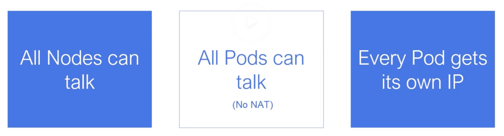

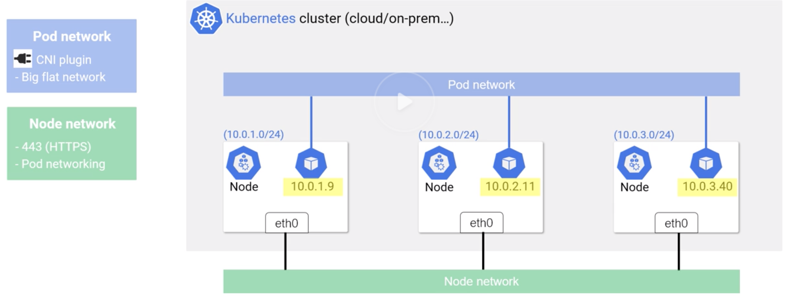

## Kubernetes Services

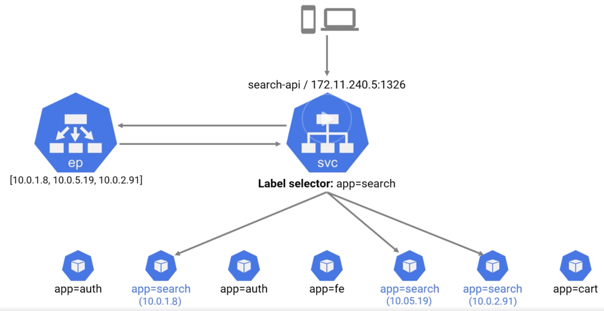

### Service Types

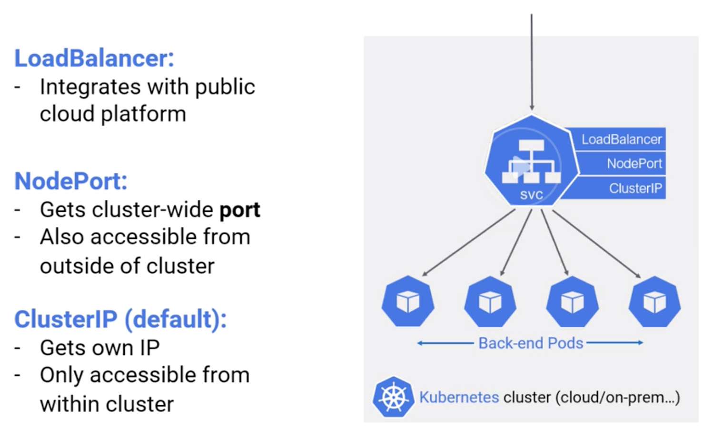

### Service Networking

#### Pod to Pod Communication on One Node

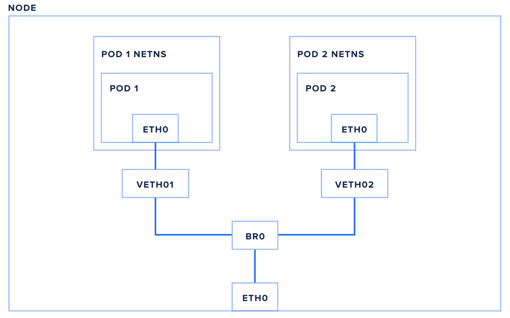

- Each node has a network interface – eth0 in this example – attached to the Kubernetes cluster network.

- This interface sits within the node's root network namespace.

- Each pod on a node is assigned its own isolated network namespace.

- Pod namespaces are connected back to the root namespace with a virtual ethernet pair, essentially a pipe between the two namespaces with an interface on each end (here we're using veth1 in the root namespace, and eth0 within the pod).

- Finally, the pods are connected to each other and to the node's eth0 interface via a bridge, br0

- A bridge essentially works like a physical ethernet switch, using either ARP (address resolution protocol) or IP-based routing to look up other local interfaces to direct traffic to.

**Let's trace a packet from pod1 to pod2 now:**

- pod1 creates a packet with pod2's IP as its destination

- The packet travels over the virtual ethernet pair to the root network namespace

- The packet continues to the bridge br0

- Because the destination pod is on the same node, the bridge sends the packet to pod2's virtual ethernet pair

- the packet travels through the virtual ethernet pair, into pod2's network namespace and the pod's eth0 network interface

#### Pod to Pod Communication between Nodes

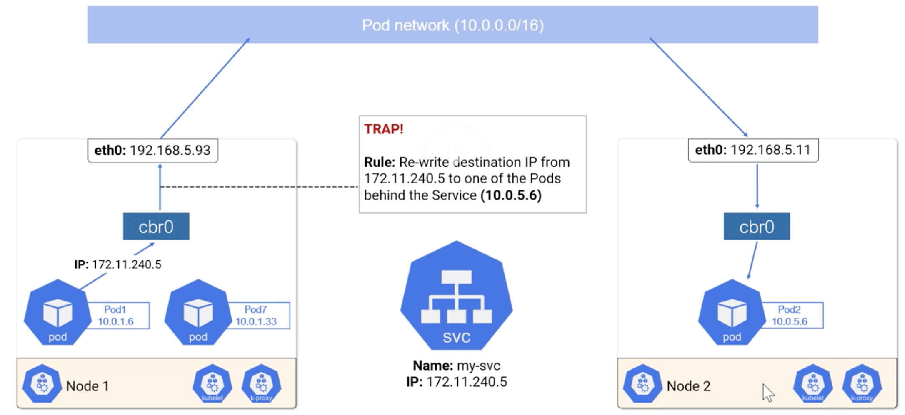

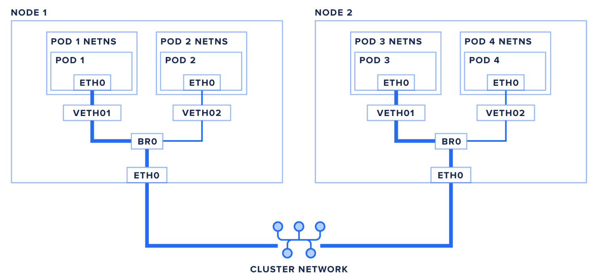

Let's trace a packet from pod1 to pod3, which is on a different node:

- pod1 creates a packet with pod3's IP as its destination

- The packet travels over the virtual ethernet pair to the root network namespace

- The packet continues to the bridge br0

- The bridge finds no local interface to route to, so the packet is sent out the default route toward eth0

- Optional: if your cluster requires a network overlay to properly route packets to nodes, the packet may be encapsulated in a VXLAN packet (or other network virtualization technique) before heading to the network. Alternately, the network itself may be set up with the proper static routes, in which case the packet travels to eth0 and out the the network unaltered.

- The packet enters the cluster network and is routed to the correct node.

- The packet enters the destination node on eth0

- Optional: if your packet was encapsulated, it will be de-encapsulated at this point

- The packet continues to the bridge br0

- The bridge routes the packet to the destination pod's virtual ethernet pair

- The packet passes through the virtual ethernet pair to the pod's eth0 interface

#### Pod to Service Networking

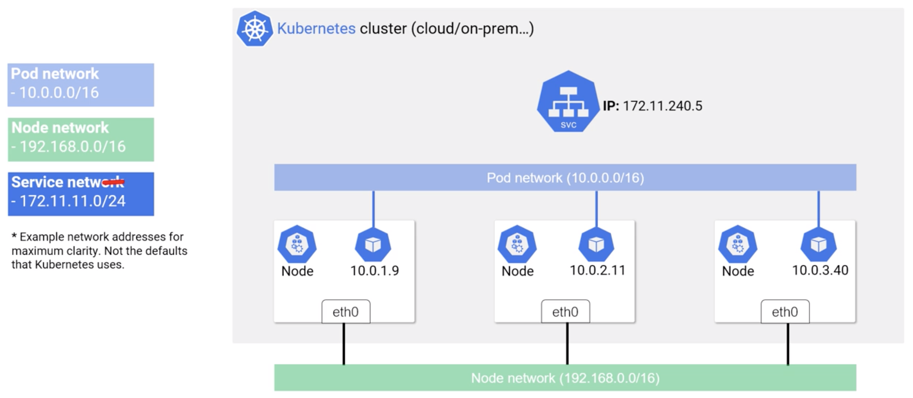

- It would be difficult to send traffic to a particular application using just pod IPs, as the dynamic nature of a Kubernetes cluster means pods can be moved, restarted, upgraded, or scaled in and out of existence.

- Kubernetes solves this problem with Services. A Service is an API object that maps a single virtual IP (VIP) to a set of pod IPs.

- Additionally, Kubernetes provides a DNS entry for each service's name and virtual IP, so services can be easily addressed by name.

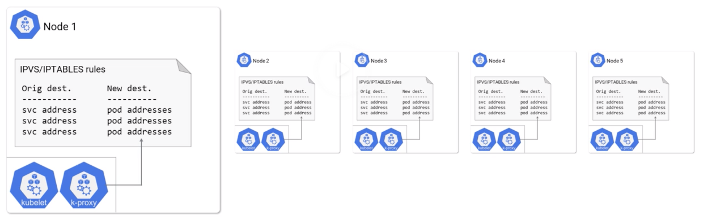

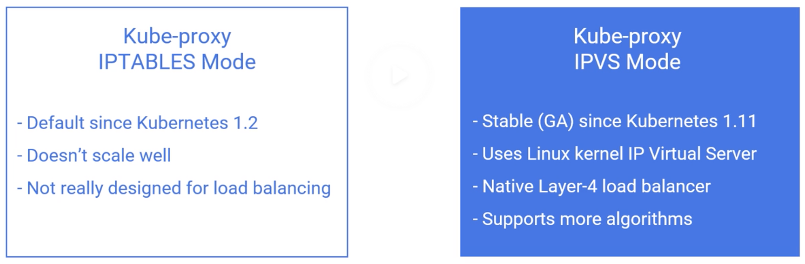

- Kube-Proxy running on each node manages the low level service level networking routing through iptables updates

- The mapping of virtual IPs to pod IPs within the cluster is coordinated by the kube-proxy process on each node.

- This process sets up either iptables or IPVS to automatically translate VIPs into pod IPs before sending the packet out to the cluster network.

- **Note:** This translation and connection tracking processes happens entirely in the Linux kernel. kube-proxy reads from the Kubernetes API and updates iptables ip IPVS, but it is not in the data path for individual packets.


### Create a ClusterIP Service

```
apiVersion: v1
kind: Service
metadata:
  name: nginx-service-clusterip
spec:
  type: ClusterIP
  selector:
    app: nginx
  ports:
  - protocol: TCP
    port: 30050
    targetPort: 80
```

**The service details:**

```
Name:              nginx-service-clusterip
Namespace:         default
Labels:            <none>
Annotations:       <none>
Selector:          app=nginx
Type:              ClusterIP
IP:                10.105.120.204
Port:              <unset>  30050/TCP
TargetPort:        80/TCP
Endpoints:         172.17.0.15:80,172.17.0.17:80,172.17.0.18:80
Session Affinity:  None
Events:            <none>
```

**The backend pods for this service:**

```
>>> kubectl get pods -o wide
NAME                                READY   STATUS      RESTARTS   AGE   IP            NODE      
nginx-deployment-784b7cc96d-4whdj   1/1     Running     1          21d   172.17.0.17   minikube   
nginx-deployment-784b7cc96d-jsp2s   1/1     Running     1          21d   172.17.0.18   minikube   
nginx-deployment-784b7cc96d-zrwfs   1/1     Running     1          21d   172.17.0.15   minikube   
```

So the service has created `end-points` for each backend pods `IP:Port`

**The node is a `minikube`**

#### iptables inside the minikube

- This service is bound to port `30050`

- Login to minikube: `minikube ssh`

- Run the below command

  ```
  $ sudo iptables -S -t nat | grep 30050
-A KUBE-SERVICES -d 10.105.120.204/32 -p tcp -m comment --comment "default/nginx-service-clusterip: cluster IP" -m tcp --dport 30050 -j KUBE-SVC-BNADCOKSJRTPXUOH
  ```

- Notice that is doing a -j (jump) to another chain/extension , in this case KUBE-SVC-BNADCOKSJRTPXUOH

- Lets see the `iptables` rule for `KUBE-SVC-BNADCOKSJRTPXUOH`

  ```
  $ sudo iptables -S -t nat | grep KUBE-SVC-BNADCOKSJRTPXUOH
-N KUBE-SVC-BNADCOKSJRTPXUOH
-A KUBE-SERVICES -d 10.105.120.204/32 -p tcp -m comment --comment "default/nginx-service-clusterip: cluster IP" -m tcp --dport 30050 -j KUBE-SVC-BNADCOKSJRTPXUOH
-A KUBE-SVC-BNADCOKSJRTPXUOH -m statistic --mode random --probability 0.33332999982 -j KUBE-SEP-FAGHYLWQUUH3IOAE
-A KUBE-SVC-BNADCOKSJRTPXUOH -m statistic --mode random --probability 0.50000000000 -j KUBE-SEP-YP3W34LIPPQTOVNM
-A KUBE-SVC-BNADCOKSJRTPXUOH -j KUBE-SEP-5YOGA5NVOUBKK72C
```

- This is showing jumps to three more services:
  ```
  KUBE-SEP-FAGHYLWQUUH3IOAE
  KUBE-SEP-YP3W34LIPPQTOVNM
  KUBE-SEP-5YOGA5NVOUBKK72C
  ```
- Lets look into one of them: `KUBE-SEP-FAGHYLWQUUH3IOAE`

  ```
  $ sudo iptables -S -t nat | grep KUBE-SEP-FAGHYLWQUUH3IOAE
-N KUBE-SEP-FAGHYLWQUUH3IOAE
-A KUBE-SEP-FAGHYLWQUUH3IOAE -s 172.17.0.15/32 -j KUBE-MARK-MASQ
-A KUBE-SEP-FAGHYLWQUUH3IOAE -p tcp -m tcp -j DNAT --to-destination 172.17.0.15:80
  ```

- And its forwarding the traffic to one of the backend pod: `172.17.0.15:80`


### Create a NodePort Service

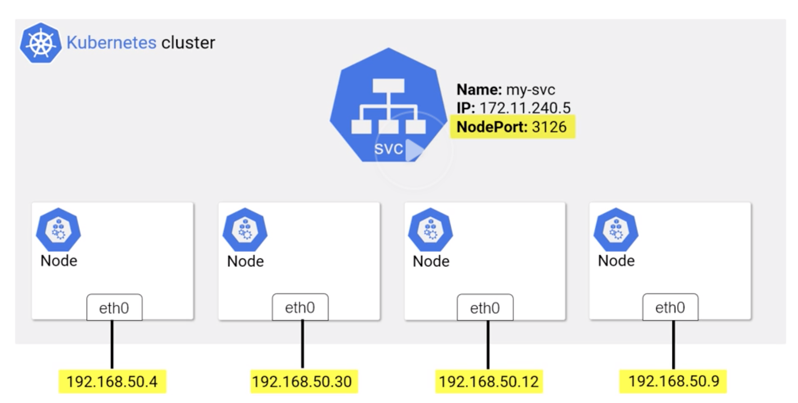

```
apiVersion: v1
kind: Service
metadata:
  name: nginx-service-nodeport
spec:
  type: NodePort
  selector:
    app: nginx
  ports:
  - protocol: TCP
    targetPort: 80
```

**The service details:**

```
Name:                     nginx-service-nodeport
Namespace:                default
Labels:                   <none>
Annotations:              <none>
Selector:                 app=nginx
Type:                     NodePort
IP:                       10.108.67.24
Port:                     <unset>  80/TCP
TargetPort:               80/TCP
NodePort:                 <unset>  30465/TCP
Endpoints:                172.17.0.15:80,172.17.0.17:80,172.17.0.18:80
Session Affinity:         None
External Traffic Policy:  Cluster
Events:                   <none>
```

**The backend pods for this service:**

```
>>> kubectl get pods -o wide
NAME                                READY   STATUS      RESTARTS   AGE   IP            NODE      
nginx-deployment-784b7cc96d-4whdj   1/1     Running     1          21d   172.17.0.17   minikube   
nginx-deployment-784b7cc96d-jsp2s   1/1     Running     1          21d   172.17.0.18   minikube   
nginx-deployment-784b7cc96d-zrwfs   1/1     Running     1          21d   172.17.0.15   minikube   
```

So the service has created `end-points` for each backend pods `IP:Port`


### Tinkering with Pod Networking

- Each Kubernetes pod gets assigned its own network namespace.

- It can be useful to run commands from within a pod's netns, to check DNS resolution or general network connectivity.

- Lets list the containers for a pod as below, run it from the node:

  ```
  docker ps | grep nginx-deployment-784b7cc96d-4whdj
ae8535e7dd39        94ec7e53edfc                      "nginx -g 'daemon of…"   About an hour ago   Up About an hour                        k8s_nginx_nginx-deployment-784b7cc96d-4whdj_default_e791506c-8fa9-11e9-a29b-080027d717d4_1
790816c708b6        k8s.gcr.io/pause:3.1              "/pause"                 About an hour ago   Up About an hour                        k8s_POD_nginx-deployment-784b7cc96d-4whdj_default_e791506c-8fa9-11e9-a29b-080027d717d4_1
```
- The first container is the `nginx-deployment` app running in the `nginx-deployment-784b7cc96d-4whdj` pod

- The second is a pause container running in the `nginx-deployment-784b7cc96d-4whdj` pod. This container exists solely to hold onto the pod's network namespace

- Lets get the PID for the above containers:

```
  docker inspect --format '{{ .State.Pid }}' ae8535e7dd39
```

- We will use a command `nsenter` to run a command in the pod's namespace

- One advantage of using `nsenter` to run commands in a pod's namespace – versus using something like docker exec – is that you have access to all of the commands available on the node, instead of the typically limited set of commands installed in containers.

**Finding a Pod's Virtual Ethernet Interface**

- Each pod's network namespace communicates with the node's root netns through a virtual ethernet pipe.

- On the node side, this pipe appears as a device that typically begins with veth and ends in a unique identifier, such as veth77f2275 or veth01. Inside the pod this pipe appears as eth0.

- First, run ip addr in the pod's network namespace using nsenter.

```
  $ sudo nsenter -t 5787 -n ip addr
1: lo: <LOOPBACK,UP,LOWER_UP> mtu 65536 qdisc noqueue state UNKNOWN group default qlen 1000
    link/loopback 00:00:00:00:00:00 brd 00:00:00:00:00:00
    inet 127.0.0.1/8 scope host lo
       valid_lft forever preferred_lft forever
2: sit0@NONE: <NOARP> mtu 1480 qdisc noop state DOWN group default qlen 1000
    link/sit 0.0.0.0 brd 0.0.0.0
36: eth0@if37: <BROADCAST,MULTICAST,UP,LOWER_UP> mtu 1500 qdisc noqueue state UP group default
    link/ether 02:42:ac:11:00:11 brd ff:ff:ff:ff:ff:ff link-netnsid 0
    inet 172.17.0.17/16 brd 172.17.255.255 scope global eth0
       valid_lft forever preferred_lft forever
```

- `36: eth0@if37` is the virtual ethernet pipe end inside the pod

- `eth0@if37` - This means this pod's eth0 is linked to the node's 11th interface.

- Now run `ip addr` on the node

```
  $ ip addr
1: lo: <LOOPBACK,UP,LOWER_UP> mtu 65536 qdisc noqueue state UNKNOWN group default qlen 1000
    link/loopback 00:00:00:00:00:00 brd 00:00:00:00:00:00
    inet 127.0.0.1/8 scope host lo
       valid_lft forever preferred_lft forever
    inet6 ::1/128 scope host
       valid_lft forever preferred_lft forever
2: eth0: <BROADCAST,MULTICAST,UP,LOWER_UP> mtu 1500 qdisc pfifo_fast state UP group default qlen 1000
    link/ether 08:00:27:d7:17:d4 brd ff:ff:ff:ff:ff:ff
    inet 10.0.2.15/24 brd 10.0.2.255 scope global dynamic eth0
       valid_lft 82906sec preferred_lft 82906sec
    inet6 fe80::a00:27ff:fed7:17d4/64 scope link
       valid_lft forever preferred_lft forever
...
...
37: veth8459e8f@if36: <BROADCAST,MULTICAST,UP,LOWER_UP> mtu 1500 qdisc noqueue master docker0 state UP group default
    link/ether 9a:3e:78:be:36:2e brd ff:ff:ff:ff:ff:ff link-netnsid 12
    inet6 fe80::983e:78ff:febe:362e/64 scope link
       valid_lft forever preferred_lft forever
       ```

- The 37th interface is veth8459e8f in this example output. This is the virtual ethernet pipe to the pod we're investigating.

**Inspecting Iptables Rules**

- To list just the Kubernetes Service NAT rules, use the iptables command and the -L flag to specify the correct chain:

```
  $sudo iptables -t nat -L KUBE-SERVICES
Chain KUBE-SERVICES (2 references)
target     prot opt source               destination
KUBE-SVC-JD5MR3NA4I4DYORP  tcp  --  anywhere             10.96.0.10           /* kube-system/kube-dns:metrics cluster IP */ tcp dpt:9153
KUBE-SVC-XGLOHA7QRQ3V22RZ  tcp  --  anywhere             10.111.17.75         /* kube-system/kubernetes-dashboard: cluster IP */ tcp dpt:www
KUBE-SVC-LC5QY66VUV2HJ6WZ  tcp  --  anywhere             10.103.161.42        /* kube-system/metrics-server: cluster IP */ tcp dpt:https
KUBE-SVC-BNADCOKSJRTPXUOH  tcp  --  anywhere             10.105.120.204       /* default/nginx-service-clusterip: cluster IP */ tcp dpt:30050
KUBE-SVC-I64SNEMOLCWHJHS3  tcp  --  anywhere             10.108.67.24         /* default/nginx-service-nodeport: cluster IP */ tcp dpt:www
KUBE-SVC-NPX46M4PTMTKRN6Y  tcp  --  anywhere             10.96.0.1            /* default/kubernetes:https cluster IP */ tcp dpt:https
KUBE-SVC-TCOU7JCQXEZGVUNU  udp  --  anywhere             10.96.0.10           /* kube-system/kube-dns:dns cluster IP */ udp dpt:domain
KUBE-SVC-ERIFXISQEP7F7OF4  tcp  --  anywhere             10.96.0.10           /* kube-system/kube-dns:dns-tcp cluster IP */ tcp dpt:domain
KUBE-NODEPORTS  all  --  anywhere             anywhere             /* kubernetes service nodeports; NOTE: this must be the last rule in this chain */ ADDRTYPE match dst-type LOCAL```

- The below lines from the output shows the services we created previously:

```
  target     prot opt source               destination
  KUBE-SVC-BNADCOKSJRTPXUOH  tcp  --  anywhere             10.105.120.204       /* default/nginx-service-clusterip: cluster IP */ tcp dpt:30050
KUBE-SVC-I64SNEMOLCWHJHS3  tcp  --  anywhere             10.108.67.24         /* default/nginx-service-nodeport: cluster IP */ tcp dpt:www
```


### Important Points
